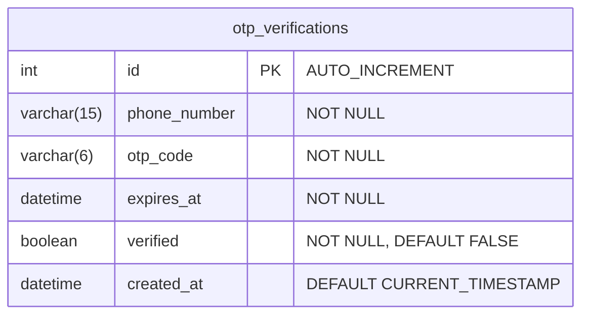

# Yojsetu — ER Diagram

Living document. Add new entities below as tables are introduced.
Each entity includes all columns with their type and any key/constraint annotations.

---

## Tables

### `otp_verifications`
*Added: 2026-09 (FastAPI backend rebuild)*

Purpose: Staging table for phone OTP verification during registration.
No `users` row exists yet at this stage — this records that a code was sent
to a given number and whether it was verified.

> **Note:** `otp_verifications` currently has no foreign keys because no `users`
> table exists yet. When `users` is added in a future task, `phone_number` will
> link to `users.phone_number` (or `users.id` via a FK), and this diagram will
> be updated to show that relationship.
